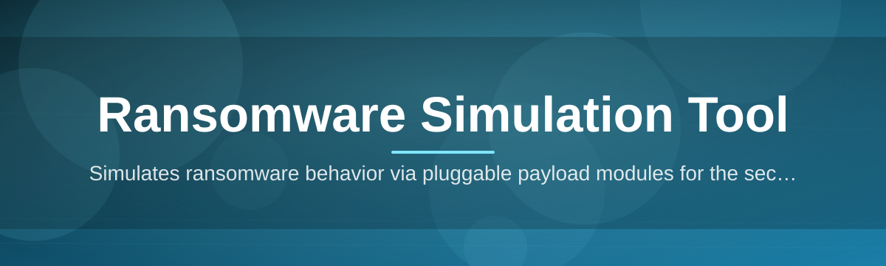
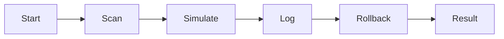

# Ransomware-Simulation-Tool-4982 🛡️🔐

  

*A safe, contained sandbox that mimics ransomware behavior so defenders can rehearse the worst day before it happens.*

  

## 📋 Requirements

| Requirement | Minimum | Recommended |
|---|---|---|
| OS | Windows 10 (64-bit) | Windows 11 (64-bit) |
| RAM | 4 GB | 8 GB+ |
| Disk space | 250 MB | 1 GB (for logging & scenario packs) |
| Privileges | Standard user | Local administrator (for full telemetry) |
| .NET / Runtime | Bundled, none required | — |
| Network | Optional (offline mode supported) | Isolated VM or lab network |

> [!IMPORTANT]
> This is a **simulation tool**. It does not encrypt real files by default, does not exfiltrate data, and ships with zero destructive payloads enabled out of the box. It exists to train, test, and validate — not to cause harm.

---

## 🧭 Overview

**TL;DR: A blue-team training rig that reproduces ransomware *behavior patterns* — file enumeration, mock-encryption routines, ransom-note drops, and C2-style beacon simulation — inside a controlled, reversible sandbox.**

Ransomware-Simulation-Tool-4982 was built for the unglamorous but essential work of incident-response rehearsal. Instead of theorizing about how a ransomware strain might traverse a shared drive or how fast an EDR agent should flag mass file renames, you get to *watch it happen* in real time, on a machine you control, with an undo button always within reach. The tool models the recognizable phases of a ransomware lifecycle — reconnaissance, staging, mock-encryption, notification drop, and simulated lateral movement — so that security teams, students, and SOC analysts can measure detection speed, tune alerting thresholds, and pressure-test their playbooks against something more tangible than a slide deck.

It exists because tabletop exercises only go so far. Reading about a ransomware kill chain is not the same as seeing your monitoring stack light up (or stay silent) while a simulated payload walks a directory tree. This tool closes that gap for security researchers, university cybersecurity programs, SOC teams building detection rules, and hobbyists studying malware analysis fundamentals — all without touching a single byte of production data or requiring a real, live ransomware sample anywhere near your network.

Who is this for? Blue teamers validating EDR coverage. Red teamers building realistic attack narratives for purple-team days. Educators who need a repeatable, safe demo for a classroom. And curious tinkerers who want to understand ransomware mechanics from the inside, structurally, rather than from a headline.

---

## 🔥 What It Actually Does

**TL;DR: Nine capabilities that turn abstract "ransomware risk" into something you can click, watch, log, and learn from.**

- **Behavior-accurate file walk simulation** — recursively enumerates a designated sandbox directory the same way real-world ransomware families scope their targets, without ever leaving that boundary.

- **Reversible mock-encryption engine** — renames and marker-tags files with a dummy cipher routine so you can observe entropy/rename-pattern detection without any real cryptographic lockout.

- **Ransom note choreography** — drops customizable, clearly-labeled decoy notes (HTML/TXT) so you can test how your alerting pipeline reacts to note-drop indicators.

- **Simulated C2 beacon traffic** — optional module that fires harmless, clearly-tagged network calls to a loopback or lab endpoint, useful for testing network detection rules.

- **Scenario builder** — chain phases (recon → staging → "encryption" → notification) into named, repeatable scenario profiles you can save and re-run for consistent testing.

- **Live event timeline** — a running log panel timestamps every simulated action, exportable to CSV/JSON for feeding into your SIEM or a post-exercise report.

- **One-click rollback** — every mock-encryption run pairs with a restoration routine that reverses file changes, because a training tool that can't clean up after itself isn't a training tool.

- **Offline-first design** — runs fully air-gapped; no telemetry leaves your machine unless you explicitly enable the beacon module.

- **Portable, standalone binary** — no installer wizard, no background services, no dependency chain to fight with.

> [!TIP]
> New to the project? Look for issues tagged `good-first-issue` — most are documentation polish, UI copy tweaks, or small scenario-template additions. Great entry points for first-time contributors.

---

## 🚀 How to Get Started

**TL;DR: Visit the landing page, download, extract, run — you're rehearsing an incident in under five minutes.**

1. **Visit the project landing page** using the download button above or below — this is the only official distribution point.

2. **Download the latest release package** for Windows 10/11 (64-bit).

3. **Extract the archive** to a folder of your choosing — no installer, no registry writes, no system-wide footprint.

4. **Launch the executable inside an isolated environment** (a VM or dedicated lab machine is strongly recommended) and pick a scenario profile from the launcher screen.

> [!WARNING]
> Always run simulations inside a virtual machine or a machine that holds no production or personal data. While mock-encryption is reversible by design, best practice in any security-adjacent testing is to assume nothing and isolate everything.

---

## 💻 System Requirements

**TL;DR: Windows 10/11, 64-bit, standalone — nothing else to install.**

- Windows 10 or Windows 11, 64-bit edition

- 4 GB RAM minimum (8 GB recommended for logging + scenario replay)

- 250 MB free disk space, more if you export detailed run logs

- No external runtimes, frameworks, or package managers required — it's a self-contained binary

- Administrator privileges are optional but unlock deeper file-system and process telemetry

  

---

## ⚙️ How It Works

**TL;DR: Load a scenario, walk the sandbox tree, simulate the phases, log everything, then roll it all back.**

The engine is intentionally modular. Each scenario profile is a small, human-readable configuration describing which phases to run and in what order. When you press start, the tool spins up a controlled worker thread that walks only the designated sandbox path — it never reaches outside that boundary. Each phase fires its own logged event, and the rollback module keeps a manifest of every change so restoration is a single click, not a manual cleanup job.

1. **Start** — pick or build a scenario profile.
2. **Scan** — the sandbox directory is enumerated, mirroring recon behavior.
3. **Simulate** — mock-encryption, note drops, and optional beacon events fire in sequence.
4. **Log** — every action is timestamped and written to the event timeline.
5. **Rollback / Result** — restore original file state and review the exportable report.

---

## 🛟 Troubleshooting

**TL;DR: Most issues trace back to antivirus quarantine, permission scope, or a sandbox path pointed at the wrong folder.**

<strong>My antivirus quarantined the executable immediately — is that expected?</strong>

Yes, this is common and expected. Because the tool intentionally mimics ransomware behavior patterns for training purposes, heuristic AV engines may flag it. Add an exclusion for the tool's folder in a lab or VM environment, never on a production machine.

<strong>The mock-encryption phase says "sandbox path not set" — what do I do?</strong>

You need to explicitly select a sandbox directory in the launcher before running any scenario. This is a deliberate safeguard so the tool never assumes a default target path.

<strong>Rollback didn't restore file names correctly.</strong>

Check that you didn't manually move or rename files mid-run — the rollback manifest maps original paths exactly. If the manifest file was deleted, restoration isn't possible, so avoid touching the `.simlog` folder during an active run.

<strong>The beacon module isn't generating any traffic.</strong>

The beacon module is disabled by default and requires you to opt in from Settings > Network Simulation. If enabled and still silent, confirm your lab network isn't blocking loopback traffic at the firewall level.

<strong>Can I run this on a production laptop for a quick demo?</strong>

You *can*, but you shouldn't. Even reversible simulations are best confined to a VM or dedicated lab box — see the Warning above.

---

## 🎨 UI / UX Details

**TL;DR: A dark-mode-first console with keyboard-driven workflow and exportable, readable logs.**

- **Themes** — Dark (default), Light, and High-Contrast, switchable from `Settings > Appearance`.

- **Keyboard shortcuts**:

  | Shortcut | Action |
  |---|---|
  | `Ctrl+N` | New scenario profile |
  | `Ctrl+R` | Run current scenario |
  | `Ctrl+Z` | Trigger rollback |
  | `Ctrl+E` | Export event log |
  | `F1` | Open in-app help |

- **Settings panel** — toggle beacon simulation, adjust simulated encryption speed, choose log verbosity (Quiet / Standard / Verbose).

- **Live timeline view** — scrollable, filterable by phase, with color-coded event severity for quick visual scanning.

> [!NOTE]
> UI strings and scenario templates are fully editable text files, making localization and custom-scenario contributions straightforward for non-developers too.

---

## 🤝 Contributing & Community

**TL;DR: Friendly, beginner-welcoming, and always short on scenario-template contributors — come help.**

We actively maintain a `good-first-issue` label for people who've never contributed to a security tooling project before. Contribution ideas that don't require deep C#/.NET knowledge:

- Writing new scenario profile templates

- Improving documentation and troubleshooting entries

- Translating UI strings

- Designing ransom-note decoy templates for testing detection rules

- Reporting edge cases where rollback behaves unexpectedly

> [!TIP]
> Before opening a pull request, check open issues for related discussion — many features get shaped colla